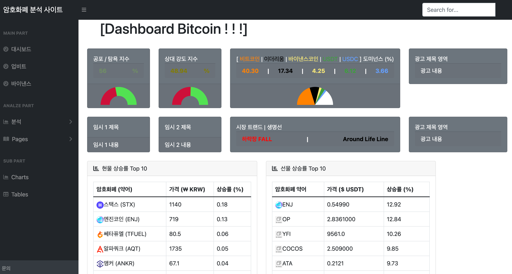

# Bitcoin Analytics Homepage
### Update Date : 2023. 03. 09
- **Deploy Site**  
    [Site](https://enchanting-valkyrie-42fb0e.netlify.app/index.html)  
        ㄴ This site is working without python(Django) file.  
        
- If you want to see more about this project.  
    [History of this project](#time-line-of-this-project)  
    [See the Image of Homepage](#homepage-image)   
- If you have any questions or something, just ask and send e-mail.  
    [Contact](#contact-with)   
- [API Refference Site](#api-받아오는-참고-사이트)
- [Notices](#notices)

# Time Line of This Project
- [Public Notion Link](https://realleonsnotebook.notion.site/Crypto-Currency-Analystics-Homepage-e40f502468fa47cc9cd5fa54107560e2)  
    You can see the history of this project imags and code progress.

# Homepage Image
1. Current Main Dashboard page   
    

    
Image

    </img> 
    </img> 
    </img> 
    

2. Spot : Upbit   
    

    
Image

    </img> 
    

3. Future : Binance Future (USDT)   
    

    
Image

    </img> 
    

   
# Contact with
- E-mail  
    tutmr999@naver.com   

  
# api 받아오는 참고 사이트
- [Fear and Greedy index (공포 탐욕 지표)](https://alternative.me/crypto/api/)
- [Upbit official API documents (업비트 공식 API 문서)](https://docs.upbit.com/docs)
- [Binance official API documents (바이낸스 공식 API 문서)](https://binance-docs.github.io/apidocs/futures/en/#general-info)
- [CoinGecko API documents (코인게코 공식 API 문서)](https://www.coingecko.com/ko/api/documentation)

# Notices
- 현재 python(Django)의 경우 업데이트를 안하고, [except python 폴더](/except_python) 안에 내용면 업데이트중 (2023년 03월 08일 이후)  
- Secrete Key  
    현재 gitignore로 업로드 안해놓은 상태,  
    따로 managy.py 파이썬 파일 위치에 secretes.json 파일이 있어야 서버가 돌아간다.  
- Python 없이 실행하기 [Click](/except_python)