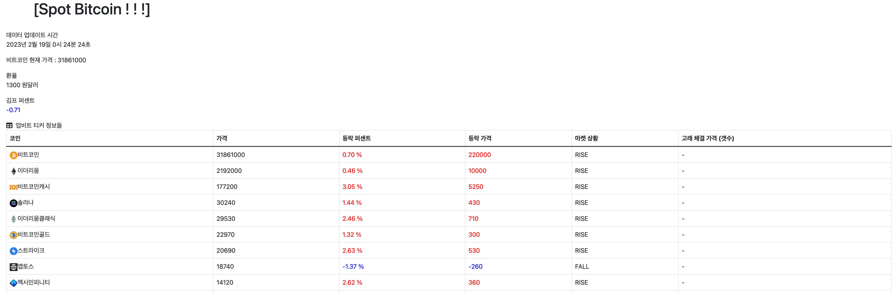

# Bitcoin Analytics Homepage
1. Current Main Dashboard page   
    

    
Image

    </img> 
    </img> 
    </img> 
    

2. Spot : Upbit   
    

    
Image

    </img> 
    

3. Future : Binance Future (USDT)   
    

    
Image

    </img> 
    

# Time Line of This Project
- [Public Notion Link](https://realleonsnotebook.notion.site/Crypto-Currency-Analystics-Homepage-e40f502468fa47cc9cd5fa54107560e2)  
    You can see the history of this project imags and code progress.

  
### api 받아오는 참고 사이트
- [Fear and Greedy index (공포 탐욕 지표)](https://alternative.me/crypto/api/)
- [Upbit official API documents (업비트 공식 API 문서)](https://docs.upbit.com/docs)
- [Binance official API documents (바이낸스 공식 API 문서)](https://binance-docs.github.io/apidocs/futures/en/#general-info)

### Contact with
- E-mail  
    tutmr999@naver.com

### Notices
- Secrete Key  
    현재 gitignore로 업로드 안해놓은 상태,  
    따로 managy.py 파이썬 파일 위치에 secretes.json 파일이 있어야 서버가 돌아간다.